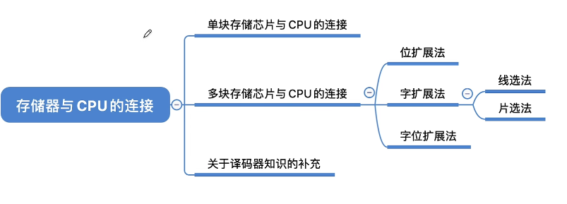
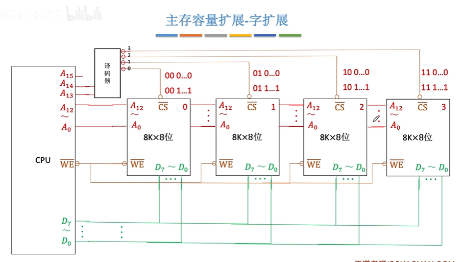
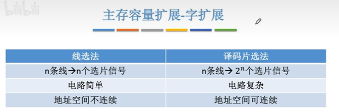
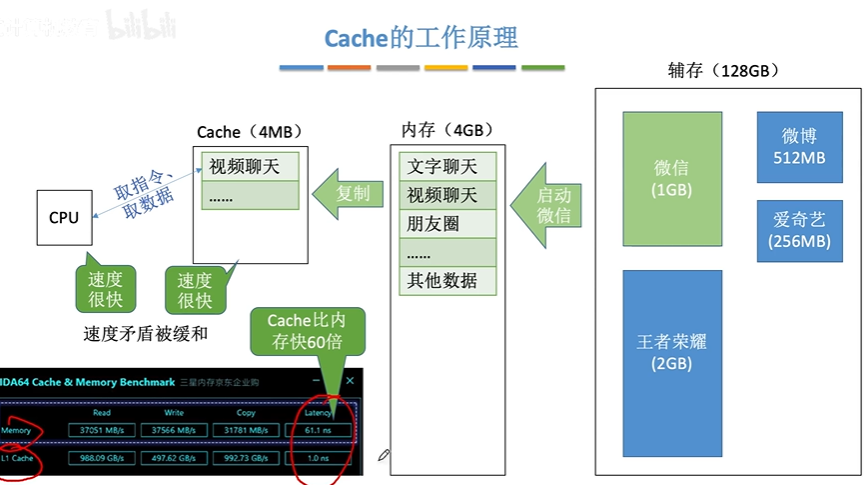
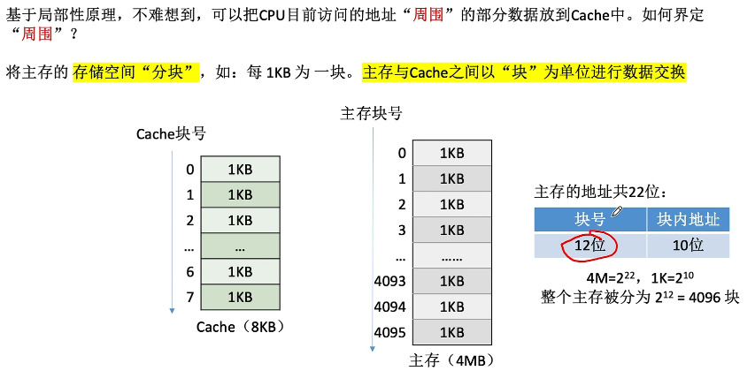
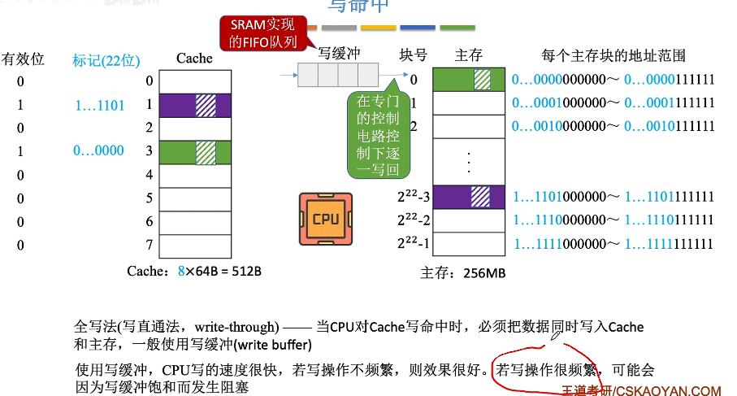
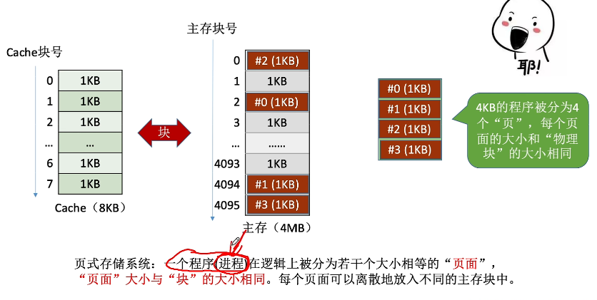
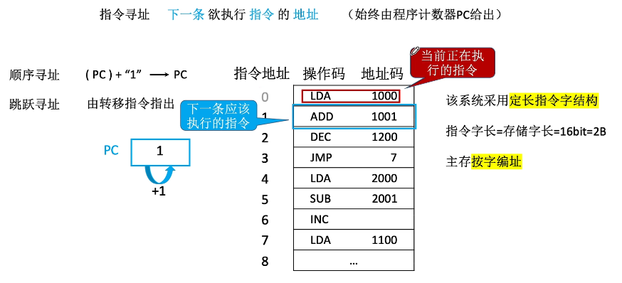
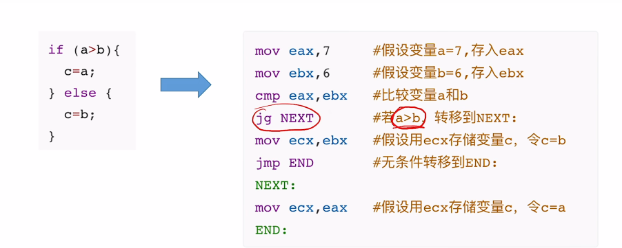
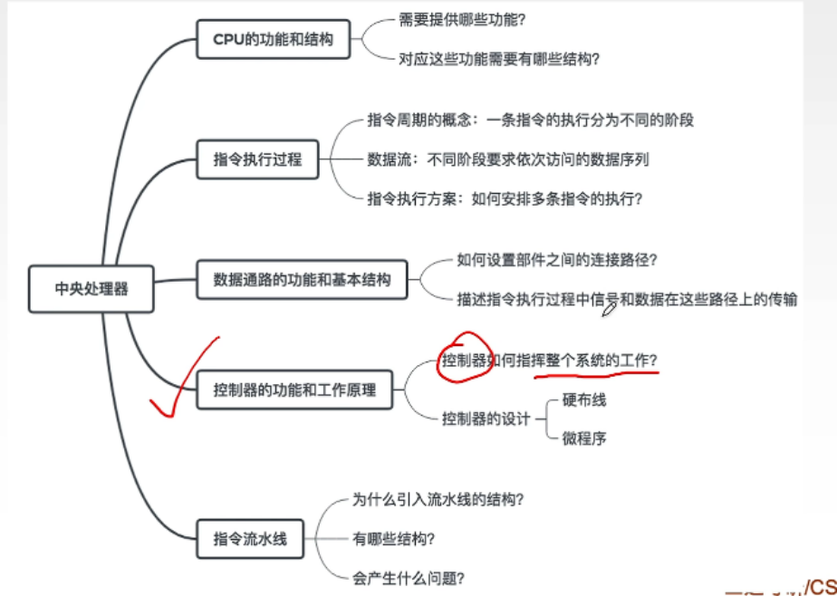

# 计组
## 计算机的基本概念

1. 用2进制代码表示程序和数据

2. 计算机采用存储程序的工作方式

   > 1. 事先编制程序
   > 2. 事先存储程序
   > 3. 自动，连续的执行程序

3. 计算机硬件由存储器，运算器，控制器，输入设备和输出设备

## 计算机的硬软件组成

### 计算机的硬件系统

- 系统总线
- CPU
- 存储系统
- 输入/输出

#### CPU

- 功能: 负责读取与执行指令，执行程序
- 基本组成：
 

寄存器，ALU，控制器，

##### 寄存器

1. 存放控制信息：PC,IR,PSW
2. 存放数据信息：通用寄存器，暂存器

##### ALU

##### 控制器

----

#### 主存储器

```properties
功能:存放需执行的程序及需要处理的数据，CPU能直接读出与写入
逻辑组成:由连续的单元组成。通常每个单元存放8个2进制数即一个字节。每个单元有一个唯一的地址
```

---

#### 输入/输出设备

```properties
输入:转成2进制
输出:2进制转从能看得懂的
```

#### 总线

----

### 计算机软件系统

#### 系统软件

```properties
功能:管理和控制计算机系统硬软件，软件资源，运行的程序，合理地组织计算机的工作流程，为用户提供软件的开发环境和运行环境

提供的用户界面:命令行用户接口(DOS)，图形用户接口（windows）
```

#### 编译程序和解释程序

- 指令与指令系统
- 机器语言
- 汇编语言
- 高级程序设计语言
- 源程序
- 解释方式
- 编译方式
- 各种软件平台

---

## 层次结构模型

```properties
第一层:微体系结构层
> 硬件层次，从寄存器级观察CPU
第二层:指令系统层
第三层:操作系统层
第四层:汇编语言层
第五层:面向问题语言层
```


## 计算机系统的性能指标

### 运算速度

- CPU时钟频率（MHZ）
- 每秒平均执行的指令条数（MIPS）
- 定点/浮点四则运算时间

---

# 王道考研

# 计算机系统概述

> **计算机系统** = **硬件** + **软件**
>
> **软件** = **系统软件**（操作系统，数据库管理系统DBMS，标准程序库，网络软件，语言处理程序，服务程序）+ **应用软件**
>
> **系统软件**-------管理计算机系统
>
> **应用软件**--------按任务需要编制成的各种程序

## 计算机的发展


-  冯诺依曼
- 微计算机，微处理器
- **机器字长**：计算机一次整数运算所能处理的二进制位数
- **编程语言**的发展
  - 机器语言（0101）
  - 汇编语言
  - 高级语言
- **操作系统**的发展
  - DOS
  - Windows
## 计算机硬件

### 基本组成

> 第一代计算机：**手动接线**控制运算

> 冯诺依曼
>
> > **存储程序**：将指令以**二进制代码**的形式事输入计算机的主存储器（**内存**），然后按其在存储器中的首地址执行程序的第一条指令，之后按顺序执行程序
>
> 特点：
>
> 1. 计算机由五大部件组成
>
> 2. 指令与数据以同等地位存于存储器，可按地址寻访
>
> 3. 指令和数据用二进制表示
> 4. 指令由操作码和地址码组成
> 5. 存储程序
> 6. 以运算为中心


> 现代计算机
>
> 1. **以存储器为中心**
> 2. CPU=运算器+控制器
>
> 

---

### 主存储器

> 主存储器=存储体+MAR+MDR
>
> **MAR**：存储**地址**寄存器
>
> **MDR**：存储**数据**寄存器


---

### 层次结构


---

### 性能指标

> 存储器
>
> 例题：
>
> ​	MAR为32位，MDR为8位
>
> ​	总容量=2^32 *8 bit =4 GB

> CPU
>
> 1. **CPU主频**（时钟频率）= 1 /**CPU时钟周期**
>
> 2. **CPI**：执行一条指令所需的时钟周期数
>
> 例题：
>
> ​	主频为1000HZ，程序100条指令，CPI=3，
>
> ​	要100 X 3 X (1/1000)=0.3秒
>
> 3. **IPS**：每秒执行多少指令
> 4. **FLOPS**：每秒执行多少次浮点运算

> 系统整体
>
> 1. **数据通路带宽**：数据总线一次所能传送信息的位数
> 2. **吞吐量**：指单位时间内处理请求的数量
> 3. **相应时间**

## 计算机的结构


```properties
算术逻辑单元ALU:计算
累加寄存器AC: 寄存中间值
数据缓存寄存器DR:类存储器 暂存数据
状态条件寄存器PSW:存储状态

程序计数器PC:存放下一条指令的地址，自动++
指令寄存器IR:存放当前执行的指令
指令译码器
时序部件
```

---

# 数据的表示与运算


> 基数：10进制的基数为10

## BCD码

> 8421码（非法区间[10,15]）有权码
>
> - 985=1001	1000	0101
> - 0101 + 1000 = 1101+6(0110)=0001 0011

## 字符与字符串

> ASCII 码 A--65	a--97

> 汉字 GB2312-80
>
> - 区位码：区码+位码 （16行 01列）
>
> 防止与ASCII冲突
>
> - 国标码=区码+20H	位码+20H
> - 机内码=国标码+80H   位码+80H

### 奇偶校验码

> 根据1的个数在第一位加上0或1
>
> - 检测错误	d>=e+1
> - 纠正错误   d>=2e+1

### 海明码

```properties
信息位:n
校验位:k
2^k >= n+k+1
```

## 定点数 VS 浮点数


## 定点数

### 概述


---

### 无符号数

- 只有数值位，没有符号位

- 通常只有无符号整数，没有无符号小数

- 表示范围

  - 8位2进制数

    0000 0000 ~ 1111 1111 

    0               ~  255

  - n位的无符号数的范围

    0 ~ 2^n -1 

---

### 符号数

- 

- 原码

  

  

- 反码

  表示范围与原码一致

- 补码

  原码的范围  -1

  转换到原码：取反 +1

  **补码的加减法得出的是原码**

- 移码

  在补码的基础上，符号位取反

  

---

#### [x]补 求[-x]补

> 符号位，数值全部取反 ，末位+1

-----

### 定点数的运算

---

#### 移位运算

##### 概述


##### 算数移位


##### 逻辑移位


##### 循环移位


---

#### 加减运算

> 原码
>
> 正+负 / 负＋正 
>
> 绝对值大的减绝对值小的，符号同绝对值大的数

> 补码
>
> 

---

#### 溢出的判断


或者 `异或` 判断


不同时溢出

>  `双符号位`

 

---

####  乘法运算

> 原码的一位乘法


> 补码的一位乘法


----

### 除法运算

> 原码	恢复余数法


> 原码    不恢复余数法（加减交替法）


> 补码	加减交替法


---

## 浮点数

### 概述


### 表示

> +3.026 * 10^11


> 阶码：常用补码表示定点整数 （11）

> 尾数：常用补码来表示定点小数（3.026）

例：


> 规格化


---

### 浮点数标准 

> IEEE 754
>
> 移码=真值+偏置值


### 浮点数运算

1. 对阶
2. 尾数加减
3. 规格化
4. 舍入
5. 判溢出

> 加减运算


---

# 存储系统

## 基本概念

### 现代计算机的结构


### 存储器的层次化结构


辅存中的数据要调入主存后才能被CPU访问

 

固态硬盘（尤其是m.2接口）的读取速度远大于机械硬盘

### 存储器的分类


### 存储器的性能指标


数据的宽度 = 存储字长 = MDR 位数

## 主存储器

### 基本的半导体元件与原理

主存储器 = 存储体 +MAR（地址存储器）+ MDR（数据存储器）


MOS管可理解为一种电控开关，输入电压达到某个阈值时，MOS管就可以接通。

### 存储器芯片的基本原理


### 寻址


## SRAM DRAM


### 存储元件的差异

DRAM芯片：使用`栅极电容`存储信息


SRAM芯片：使用`双稳态触发器`存储信息


### DRAM的刷新


### DRAM的地址线复用技术


## ROM只读存储器

```properties
RAM:易失性，断电后数据消失
ROM:非易失性，断电后数据不会丢失
```

### 各种ROM


### 计算机内的重要ROM


注：我们常说“内存条”就是“主存”，但事实上，主板上的ROM芯片也是“主存”的一部分。

## 主存储器与cpu的连接

### 知识总览



### 单块存储芯片与CPU的连接


> - 想要扩展主存字数怎么办？——字拓展
> - 数据总线宽度>存储芯片字长，怎么办？——位扩展

#### 位扩展


#### 字扩展


线选法：A13、A14只能为01或10

​					n条线 ——> n个选片信号 


通过非门解决线选法的问题


译码片选法：n条线 ——> 2^n 个片选信号



#### 扩展比较



### 译码器


### 双口RAM


- 多核CPU都要访问，怎么办？
- CPU的读写速度比主存快很多，主存恢复时间太长怎么办？


### 多体并行存储器

> CPU的读写速度比主存快很多，主存恢复时间太长怎么办？


- 高位：通过高位决定用哪个存储器
- 低位：相反


> 应该取几个"体"?

存取周期为T，存取时间为r，为了使流水线不间断，应保证模块数 m >= T / r


> 多模块存储器的特点

- 每个模块都有相同的容量和存取速度
- 各模块都有独立的读写控制电路，地址寄存器，数据寄存器
- 既能并行工作，又能交叉工作


### 总结


> 双通道内存

低位交叉的2体存储器

## 外部存储器（了解）

### 磁盘存储器

机械硬盘、磁带

> 优点：

1. 存储容量大，价格低
2. 记录介质可以重复使用
3. 记录信息可以长期保存而不丢失，甚至可以脱机存档
4. 非破坏性读出

> 缺点：

1. 存取速度慢
2. 机械结构复杂
3. 对工作环境要求高


### 固态硬盘SSD


## Cache

### 工作原理



### 局部性原理


基于局部性原理，可以把CPU目前访问的地址“周围”的部分数据放到cache中

### 性能分析

设tc为访问一次Cache所需时间，tm为访问一次主存所需的时间。

`命中率H`：CPU欲访问的信息已在Cache中的比率

`缺失率M`：M = 1 - H

`平均访问时间`：t = H * tc + ( 1 - H ) * ( tc + tm ) 

​							或  t = H * tc + ( 1 - H ) * tm

先到cache里找，找不到再到主存中

> 例


> 分块进行数据交换



### Cache与主存的映射

> 分类

1. `全相联映射`：主存块可以放在Cache的任意位置

2. `直接映射`：每个主存块只能放到一个特定的位置Cache块号 = 主存块号 % Cache总块数

3. `组相联映射`：Cache块分为若干组，每个主存块可放到特定分组的任意一个位置

   组号 = 主存块号 % 分组数


> 具体实现


> 全相联映射


> 直接映射


优化


CPU访问主存地址：

1. 根据主存块号的后3位确定Cache行
2. 若主存块号的前19位于Cache标记匹配且有效位=1，则Cache命中，f访问Cache块
3. 若未命中或有效位=0，则正常访问主存

> 组相联映射


### Cache满了怎么办——替换算法

> 随机算法RAND

若Cache已满，则随机选择替换


> 先进先出FIFO


> 近期最少使用LRU


[3.5_3_Cache替换算法_哔哩哔哩_bilibili](https://www.bilibili.com/video/BV1ps4y1d73V?p=40&spm_id_from=pageDriver&vd_source=a97555db7a704882626ff6b3dff1617c)


> 最不经常使用算法LFU


### Cache与主存的一致性——Cache写策略

> 写命中

写回发


全写法（写直通法）


加上写缓冲



> 写不命中

写分配法


非写分配法


---

## 页式存储器

### 什么是分页

​        将4KB的程序分为4个1KB的`页` ，页的大小与主存每个块的大小相等。


​		程序分为页后，页在主存中存储不一定连续



### 虚地址 VS 实地址

逻辑地址（虚地址）：程序员视角看到的地址

物理地址（实地址）：实际在主存中的地址


> 逻辑地址 到 物理地址 的转换

程序上的分页 到 主存上的地址


### 页表

> 页表：逻辑页号 ——> 主存块号 


### 地址转换过程（重要）


引入快表TLB，缓存页表


## 虚拟存储器

### 是什么

用户感知到的容量要比实际要大


### 页式虚拟存储器


## 段式存储器


# 指令系统


- 控制器：
  - 解析指令
  - 根据指令解析操作

> 回忆：计算机的工作流程


- 操作码：指名“做什么”
- 地址码：指名“对谁动手”

## 指令的定义


指令 = 操作码 （OP）+ 地址码 （A）


> 零地址指令


> 一地址指令


> 二地址指令


> 三地址指令


> 四地址指令


## 相关概念


## 操作类型

1. 数据传送

   LOAD	作用：把存储器中的数据放到寄存器中

   STORE 作用：把存储器中的数据放到存储器中

2. 算术逻辑操作

   **算术**：加、减、乘、除、增1、减1、求补、浮点运算、十进制运算

   **逻辑**：与、或、、、、、


----

## 扩展操作码


CPU通过前面1的个数判断是几地址指令

## 指令寻址

>  指令寻址：如何确定下一条指令的存放地址？


### 顺序寻址

PC指向下一台指令的地址

> 按字编址


> 按字节编址
>
> 一个字节(B) = 8bit


> 变长指令字结构


### 跳跃寻址




---

## 数据寻址

### 基本介绍


7 —— 100+7


### 十种寻址方式


> 直接寻址


> 间接寻址


> 寄存器寻址


> 寄存器间接寻址


> 隐含寻址


> 立即寻址

直接存数


> 


> 基址寻址


> 变址寻址


> 相对寻址


> 堆栈寻址


---

## 高级语言与机器代码


### X86汇编


### 常用的X86指令

> 算术运算


> 逻辑运算


> 其他


### AT&T vs Intel 格式


### 分支结构——机器级表示





### 循环语句


### 函数调用

## CISC 与 RISC


# 中央处理器

## 结构

> CPU


> 运算器


> 控制器




## 功能与结构


> 运算器


AH = AX 的高位

AL = AX 的高位


1. 算术逻辑单元
2. 通用寄存器
3. 暂存寄存器
4. 累加寄存器
5. 程序状态字寄存器
6. 移位器
7. 计数器

> 控制器

取指令，分析指令，执行指令

1. 程序计数器PC
2. 指令寄存器IR（OP+Ad）
3. 指令译码器
4. 微操作信号发生器
5. 时序系统
6. 存储器地址寄存器MAR
7. 存储器数据寄存器MDR


## 指令执行流程

> 指令周期

CPU从主存中每取出并执行一条指令所需的全部时间


## 数据通路

数据通路：数据在功能部件之间传送的路径


> 寄存器之间的数据传送

比如把PC内容送到MAR

（PC)  → BUS ：PC 内容送到总线

  BUS  → MAR  ：总线内容送到MAR

> 主存与CPU之间的数据传输

(PC) → BUS → MAR → M(MAR)  → MDR → BUS → IR

> 算术或逻辑运算

比如加法

ADD(IR) → BUS → MAR →M(MAR) →MDR →BUS → Y

(ACC + Y) →Z

> 例子


> 多总线


> 专用数据通路方式


> 例题


---

# 英文对应

```properties
CS 或 CE = 片选线,用来选择
WE 或 WR = 读写控制线
A = 地址线
D = 数据线

MAR = 地址寄存器
MDR = 数据寄存器
ACC = 累加寄存器
ALU = 算术逻辑单元，用来计算
PC = 程序计数器，存放下一条指令的地址，自动++
IR = 指令寄存器，存放当前的指令
CU = 控制单元，分析指令，给出控制信号
DR = 数据缓存寄存器
MQ = 乘商寄存器
X = 操作数寄存器
BR = 基址
IX = 变址
R = 通用寄存器

PSW = 存储状态
OP = 操作码 | 溢出标志
SF = 符号标志
ZF = 零标志
CF = 进位标志

LOAD = 把存储器中的数据放到寄存器中
STORE = 把寄存器中的数据放到存储器中
```

```properties
74LS138 = 译码器

000001 00100000000011=操作码 地址码（逻辑地址）
```

```properties
JMP = 无条件转义，跳转指令
LDA = 取数指令，到ACC
E~X = 32bit的寄存器
CLC	= CF清零
STC	= CF置位1
CMC = CF取反
CLD	= DF清零
STD = DF置位1
CLI	= IF清零，关闭中断
STI	= IF置位1，打开中断

#还有就是逻辑移位都是把移出位放在CF中然后补0，算术移位则是右移时高位不变，左移时跟逻辑移位一样。
SHL [SHift logic Left] = 逻辑左移
SHR [SHift logic Right] = 逻辑右移
SAL [Shift Arithmetic Left] = 算术左移
SAR [Shift Arithmetic Right] = 算术右移
ROL ROtate shift Left  = 循环左移
ROR ROtate shift Right = 循环右移
RCL Rotate with Carry shift Left = 带进位循环左移
RCR Rotate with Carry shift Right =  带进位循环右移
```


A~1~ 指某个主存地址，（A~1~）表示A~1~ 所指向的地址的内容


----

76.220.129.93 	

页表项长度（控制位只计算3位）？9+3

页表的大小？12（长度）* 2^19（项数）


